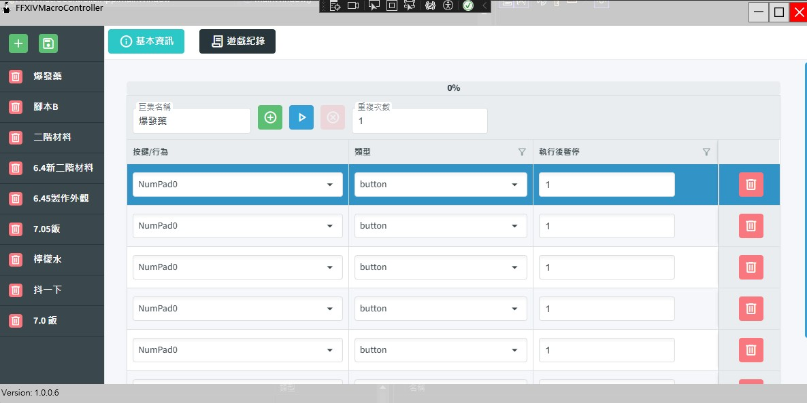
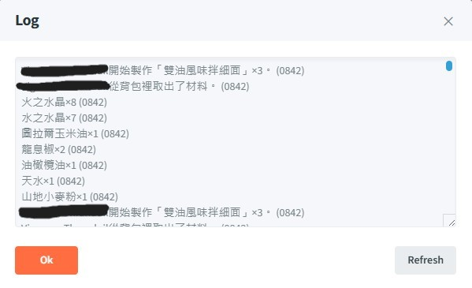

# FFXIVMacroController

## **This application does not need to rely on Dalamud or XIVLauncher.**

This is a script tool rewritten based on [BardMusicPlayer](https://github.com/BardMusicPlayer/BardMusicPlayer), [Machina](https://github.com/ravahn/machina), [Sharlayan](https://github.com/FFXIVAPP/sharlayan)

FFXIV Macro Controller 是一個專為 Final Fantasy XIV 設計的腳本控制器，旨在簡化和自動化遊戲中的多種操作。此工具提供了多種功能，包括按鍵模擬、滑鼠點擊和文本輸入等。


allow you run scripts in the background window, so you can watch YouTube or do other stuff on the same computer at the same time.

- **按鍵模擬**：自動化按鍵輸入，支持多種按鍵組合。
- **文本輸入**：自動輸入預定義的文本指令。

# How To Use

- If the selected type is [Text], the message will be sent to the game dialogue box.
- If the selected type is [Button], the button will be sent to the game window.

For detailed information, please execute the main program directly.





# Json Config Schema
```json
{
 "rootID": "6f6e556d-a5e3-4199-a3e8-e5eba5da9c73",
  "categoryList": [
    {
      "id": "6f6e556d-a5e3-4199-a3e8-e5eba5da9c73",
      "name": "腳本A",
      "category": "action",
      "repeat": 1,
      "macroList": [
        {
          "type": 1,
          "keyNumber": 49,
          "sleep": 3,
          "coordinateX": 0,
          "coordinateY": 0,
          "inputText": "/echo 123"
        },
        {
          "type": 1,
          "keyNumber": 50,
          "sleep": 3,
          "coordinateX": 0,
          "coordinateY": 0,
          "inputText": "/echo 123"
        }
      ]
    }
}
```

# Publish one single exe file
```shell
dotnet publish -c Release  --self-contained -r win-x64 -p:PublishSingleFile=true
```
