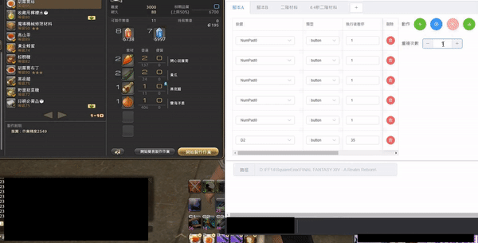
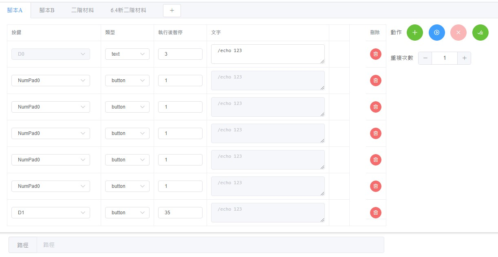

# FFXIVMacroController
FFXIVMacroController

This is a script tool rewritten based on [BardMusicPlayer](https://github.com/BardMusicPlayer/BardMusicPlayer)




# How To Use

- If the selected type is [Text], the message will be sent to the game dialogue box.
- If the selected type is [Button], the button will be sent to the game window.

For detailed information, please execute the main program directly.




# Json Config Schema
```json
{
 "rootID": "6f6e556d-a5e3-4199-a3e8-e5eba5da9c73",
  "categoryList": [
    {
      "id": "6f6e556d-a5e3-4199-a3e8-e5eba5da9c73",
      "name": "腳本A",
      "category": "action",
      "repeat": 1,
      "macroList": [
        {
          "type": 1,
          "keyNumber": 49,
          "sleep": 3,
          "coordinateX": 0,
          "coordinateY": 0,
          "inputText": "/echo 123"
        },
        {
          "type": 1,
          "keyNumber": 50,
          "sleep": 3,
          "coordinateX": 0,
          "coordinateY": 0,
          "inputText": "/echo 123"
        }
      ]
    }
}
```

# Publish one single exe file
```shell
dotnet publish -c Release  --self-contained -r win-x64 -p:PublishSingleFile=true
```