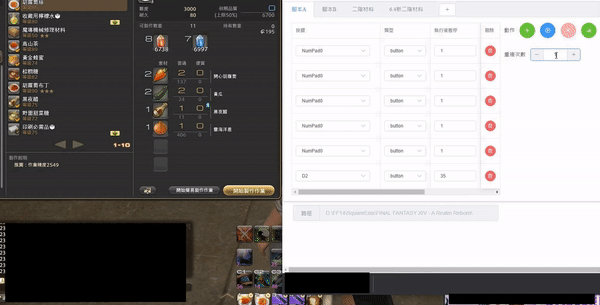
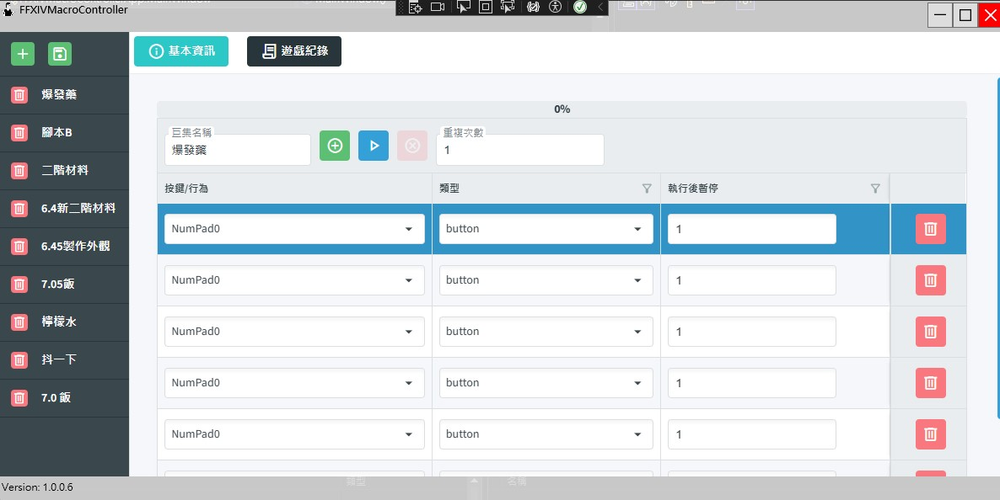
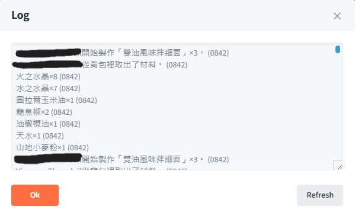

# FFXIVMacroController

## **This application does not need to rely on Dalamud or XIVLauncher.**

This is a script tool rewritten based on [BardMusicPlayer](https://github.com/BardMusicPlayer/BardMusicPlayer), [Machina](https://github.com/ravahn/machina), [Sharlayan](https://github.com/FFXIVAPP/sharlayan)

FFXIV Macro Controller 是一個專為 Final Fantasy XIV 設計的腳本控制器，旨在簡化和自動化遊戲中的多種操作。



allow you run scripts in the background window, so you can watch YouTube or do other stuff on the same computer at the same time.

- **按鍵模擬**：自動化按鍵輸入，支持多種按鍵組合。
- **文本輸入**：自動輸入預定義的文本指令，透過剪貼簿貼上至遊戲對話框。
- **圖片辨識點擊**：截取螢幕畫面，透過 OpenCV 模板比對找到目標圖片位置後自動點擊（支援左/右鍵）。

# How To Use

- If the selected type is **[Button]**, the key will be sent to the game window.
- If the selected type is **[Text]**, the message will be sent to the game chat box via clipboard.
- If the selected type is **[Mouse]**, the screen will be captured and the target image will be located using template matching. The mouse will then click the center of the matched area.

For detailed information, please execute the main program directly.





# Step Types

| type | value | description |
|---|---|---|
| button | 1 | Send key input to game window |
| mouse | 2 | Locate image on screen and click |
| text | 3 | Send text to game chat box |

# Json Config Schema

```json
{
  "rootID": "6f6e556d-a5e3-4199-a3e8-e5eba5da9c73",
  "categoryList": [
    {
      "id": "6f6e556d-a5e3-4199-a3e8-e5eba5da9c73",
      "name": "腳本A",
      "category": "action",
      "repeat": 1,
      "macroList": [
        {
          "type": 1,
          "keyNumber": 49,
          "sleep": 3,
          "inputText": ""
        },
        {
          "type": 2,
          "keyNumber": 0,
          "sleep": 3,
          "inputText": "",
          "imagePath": "C:\\path\\to\\image.jpg",
          "confidence": 0.8,
          "mouseButton": "Left"
        },
        {
          "type": 3,
          "keyNumber": 0,
          "sleep": 3,
          "inputText": "/echo hello"
        }
      ]
    }
  ]
}
```

### mouseButton values
| value | description |
|---|---|
| `Left` | 左鍵點擊 |
| `Right` | 右鍵點擊 |

# Publish one single exe file
```shell
dotnet publish -c Release --self-contained -r win-x64 -p:PublishSingleFile=true
```
